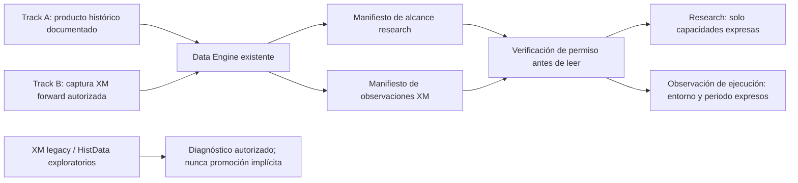

# ADR-FOUNDATION-001 — FOUNDATION RECOVERY PLAN

Fecha: 2026-09-04. **Estado: APPROVED. Aprobado por decisión humana el 2026-09-04. La implementación sigue pendiente y requiere gates separados.**

Decisor: Alex. Componentes responsables propuestos: Data Engine, contratos de sus consumers y registros existentes. No se propone un subsistema nuevo. No se ejecutó captura, adquisición, ML, Discovery, walk-forward ni backtest para redactar este ADR.

## 1. Problema y evidencia de partida

Foundation está en PHASE_1_FOUNDATION / WAITING_FOR_SOURCE_EVIDENCE. Cuello de botella: SOURCE_PROVENANCE_CLOCK_SESSION_AND_INCIDENT_ADJUDICATION. Data Engine V1 está implementado, pero DATA_ENGINE_CERTIFIED=false; Control Tower permanece bloqueado. La siguiente tarea autorizada es este diseño, no otra inferencia sobre las fuentes.

La evidencia revisada comprende los cinco expedientes de `reports/data_integrity/`, los informes Data Engine V1, costes y el incidente histórico de particiones. Inventario y hashes: `reports/foundation_recovery_plan/2026-09-04/foundation_evidence_inventory.json`. Se revisaron decisiones, contratos, verificaciones y registros; no se reabrieron históricos para repetir las auditorías.

| Evidencia existente | Hecho que limita el diseño |
|---|---|
| `reports/DATA_ENGINE_V1_VERIFICATION.json` | Motor probado con fixtures; contrato actual limitado a Parquet OHLCV M1/M5 y DEV. No captura forward certificada. |
| `reports/data_integrity/2026-09-04/REPORT.md` | XM: 1.048.576 barras; transformación/deduplicación previa a RAW; 2.679 gaps sin adjudicar, 249 spreads cero, 91 episodios stale y un salto. Un hash posterior no recupera originales descartados. |
| `reports/data_integrity/2026-09-04-source-evidence/FOUNDATION_REPORT.md` y `clock_incident.json` | Metadata actual no demuestra contrato histórico. Una respuesta MCP de reloj presenta offsets inconsistentes y no sirve como autoridad UTC. |
| `reports/data_integrity/provider-request-final-2026-09-04/PACKAGE_REPORT.md` | Solicitud XM preparada, no enviada; no existe respuesta que cierre sus blockers. |
| `reports/data_integrity/histdata-2015-2017-2026-09-04/FOUNDATION_REPORT.md` | HistData: ZIP preservados, 1.057.441 barras; 3.136 gaps, ocho stale y un salto. Sin costes XM ni reloj/calendario histórico acreditado para el alcance. |
| `reports/data_integrity/histdata-documentary-2026-09-04/FOUNDATION_REPORT.md` y `blocker_matrix.json` | URLs, eventos Chrome y streams NTFS recuperados; tres blockers PARTIAL, cinco BLOCKED, cero CLOSED. Doble descarga 2015 sin hash al descargar; discrepancia TXT 6–7s sin explicación. |
| `reports/ML_PARTITION_ACCESS_INCIDENT.json` | No basta un filtro posterior de filas; la autorización debe preceder incluso al hash de payloads protegidos. |

El gate escrito es un booleano global y algunos documentos aún describen terminar el motor como tarea futura. No hay una regla literal que obligue a certificar cada año legacy: el bloqueo indefinido aparece por **acoplar operativamente la salida de Foundation a estos pilotos sin evidencia recuperable y mezclar calidad de precios con realidad de ejecución**. No está demostrado que ningún proveedor pueda responder jamás; sí que hoy no existe una acción interna capaz de reconstruir esos hechos. Repetir inferencias no reduce el bloqueo.

Invariantes de esta decisión:

```text
XM_LEGACY = EXPLORATORY_ONLY
HISTDATA = EXPLORATORY_ONLY
DATA_ENGINE_CERTIFIED = false              [sin cambio en esta entrega]
PHASE_1_FOUNDATION = BLOCKED                [sin cambio en esta entrega]
CONTROL_TOWER = NOT_STARTED / BLOCKED       [sin cambio en esta entrega]
```

Sus incidencias y certificados se mantienen. No se eligen tramos de esas fuentes para sortear la falta de procedencia. No se añade una tercera fuente ahora ni se selecciona un proveedor en este ADR.

## 2. Decisión propuesta y reglas de arquitectura

Proponer **certificados de afirmaciones delimitadas por uso, campos, instrumento, periodo, entorno y evidencia**, en lugar de interpretar un nivel de calidad global como permiso universal. Dos tracks dentro de Data Engine comparten mecanismos de custodia/verificación, pero mantienen identidades, contratos, almacenamiento autorizado y consumers independientes.

Aplicación de ARCHITECTURE_DECISION_RULES.md:

1. Problema operacional concreto: ciclos documentales sin cierre, incertidumbre de fuente y riesgo de usar precios genéricos como costes XM.
2. Absorción existente: Data Engine ya posee RAW, manifests, hashes, quality, publicación exclusiva y frontera de lectura. Su registro puede almacenar el alcance; sus consumers pueden exigirlo.
3. La captura requiere un proceso con ciclo de vida y recuperación, pero su responsabilidad sigue siendo adquisición del mismo Data Engine. Un worker de ese componente no justifica otro engine, catálogo ni orquestador general.
4. Mejora esperada verificable: impedir lecturas fuera de alcance; reproducir cada certificado desde bytes preservados; mantener evidencia nueva sin pérdida previa a RAW; eliminar la dependencia de cerrar todas las incidencias legacy. No se promete una mejora numérica de throughput sin medición.

Alternativas: seguir esperando como única ruta conserva seguridad pero no aporta capacidad; promover por limpieza/score o semejanza de precios se rechaza; un nuevo sistema de datos duplica custodia y permisos sin necesidad. Se recomienda la extensión acotada del sistema existente.



El certificado propuesto contiene: dataset/version; proveedor y frontera de custodia; hashes de RAW/derivados/documentos; instrumento y versión contractual; intervalo [desde,hasta); partition_policy_id; uso/consumers permitidos; campos y semántica; entorno; resolución y error temporal admisible; calendario versionado; findings y disposiciones; exclusiones; receta/código/dependencias; aprobación; vigencia, revocación y limitaciones. Sin un campo obligatorio: denegar. Una certificación de intervalo finito no cubre el siguiente lote, servidor o cambio contractual automáticamente.

Cada capacidad se aprueba por evidencia. Los nombres siguientes son **vocabulario propuesto**, no enums implementados: RESEARCH_PRICE, RESEARCH_FEATURES, RESEARCH_LABELS, RESEARCH_ML, RESEARCH_WALK_FORWARD, RESEARCH_BACKTEST_PRICE; XM_FORWARD_QUOTES, XM_SYMBOL_TERMS, XM_OBSERVED_FEES, XM_EXECUTION_FILLS. La aprobación de una no implica las demás. Una capacidad neta de costes exige un contrato de costes adicional aplicable; un sello de precios no la concede.

## 3. TRACK A — CERTIFIED RESEARCH DATA

### 3.1 Contrato mínimo no negociable

| Requisito | Prueba mínima para un certificado histórico |
|---|---|
| Provenance | Identidad del distribuidor/producto/instrumento y derecho de uso; endpoint/archivo/versión, petición y recepción; procedencia y transformaciones declaradas en la frontera ofrecida. Documentos aplicables al periodo. Una URL o hash aislado no prueba procedencia. |
| Original bytes | Archivos/respuestas completos preservados antes de convertir, ordenar o deduplicar; ZIP y miembros originales cuando corresponda. Registrar límites: original del producto distribuido no equivale a ticks originales de todas las sedes. Si solo hay respuesta ya decodificada, declarar esa frontera y conservarla sin pérdida. |
| Hashes | SHA256 del objeto original, miembros, derivados, receta y documentos; identidad inmutable; registro de recepción/custodia que vincule objeto y proveedor. Hashes no sustituyen autenticación. |
| Timestamp semantics | Significado explícito de la etiqueta: BAR_OPEN/BAR_CLOSE/evento; resolución, intervalos inclusivos/exclusivos y cuándo la barra completa pasa a estar disponible. Versiones históricas y evidencia de aplicabilidad. |
| Timezone | Zona/offset y reglas DST con vigencia; fuente acreditada, no ajuste por correlación. Tiempos originales conservados; representación UTC derivada, reproducible y documentada solo después de aprobación. Ambigüedad no resuelta bloquea ese alcance. |
| Session/calendar | Calendario del producto/feed/instrumento, pausas, festivos y excepciones versionadas por periodo, con fuente acreditada. Un calendario de otra sede o morfología no sirve. |
| Schema | Tipos/unidades/precisión y significado Bid/Ask/mid/trade/OHLC; orden, duplicados/conflictos, OHLC, finitos, signos, cuadrícula y cobertura. Campos ausentes identificados como ausentes, jamás simulados para satisfacer una columna obligatoria. |
| Instrument definition | Identificador exacto, producto spot/CFD/futuro, moneda/unidad, formación del precio, resolución/tick size y cambios relevantes. Rollover/ajustes si existen. No presumir equivalencia con GOLD de XM. |
| Missing-data policy | Reglas previas al análisis económico, mapa de gaps y evidencia de cierre/no cotización/pérdida/causa desconocida. No rellenar, suavizar ni reemplazar ceros. Un dato ausente no es un precio ni un volumen cero. |
| Reproducibility | Manifiesto, RAW, código y versiones reproducibles; reconstrucción independiente del derivado y de sus permisos, trazabilidad fila→objeto; limitaciones y revocaciones verificables. |

No se exige demostrar cada transformación microscópica fuera del producto que se certifica si la afirmación científica no la usa. Sí se exige conocer y documentar el producto de origen, su semántica, calendario y límites: certificar cotizaciones Bid distribuidas no certifica mercado consolidado, profundidad, precios ejecutables ni completitud universal de ticks. Este límite no rehabilita los dos pilotos actuales.

### 3.2 Permisos por consumer

| Uso | Dependencias adicionales y denegaciones |
|---|---|
| Discovery | Certificado del precio y de todas las variables solicitadas; hipótesis/configuración pre-registradas, DEV autorizado. Certificación de datos no certifica edge. |
| Features | Campos certificados; ventanas causales y completas, event_time y available_at compatibles con decisión. No consumir close/high/low de una barra aún abierta; no usar features de volumen/spread ausentes. |
| Labels | Horizonte y definición pre-registrados; observaciones futuras permitidas solo para etiquetas; límite de partición/alcance y trayectoria completa. Una barrera cuyo orden intrabar no es observable queda indeterminada, no se resuelve a favor del resultado. |
| ML | Features y labels autorizados, splits temporales congelados; transformaciones aprendidas solo en training; purging/embargo; lineage y expiración de certificados heredados. |
| Walk-forward | Todos los folds dentro del universo autorizado, train anterior a evaluación, sin optimizar sobre folds futuros. No habilita la partición VALIDATION ni LOCKED_OOS. |
| Backtest | RESEARCH_BACKTEST_PRICE permite únicamente una simulación de precios con supuestos explícitos, sin afirmaciones de ejecución XM/neto. Para costes/neto requiere contrato de costes aplicable con su propio alcance; sin él bloquear métricas/selección/promoción basadas en neto. No introducir costes cero por omisión. |

Los escenarios hipotéticos de costes, si se autorizan después, se etiquetan como simulación y no como realidad XM certificada. No permiten afirmar edge neto ejecutable. Las rutinas ML actuales que calculan economía y seleccionan umbrales no pueden reutilizarse con datos de solo precio sin separar y bloquear esas salidas.

Una exclusión válida necesita regla de calidad aprobada antes de resultados, evidencia, registro íntegro del segmento excluido y análisis de representatividad. El contexto de features/labels tampoco puede cruzarla. Un cierre confirmado se anota sin fabricar barras. Un gap desconocido dentro del alcance bloquea la capacidad afectada; dividir el alcance no elimina una carencia global de procedencia. No se cambian thresholds de quality.py ni se seleccionan segmentos favorables por PnL.

### 3.3 Qué constituye una ruta histórica válida

Debe existir un expediente real, no una lista de proveedores o promesa de conseguir datos: producto histórico disponible con rango útil, derecho/acceso documentado, compromiso verificable de entrega de originales, semántica/instrumento/calendario aplicables, plan de custodia y compatibilidad de partición, presupuesto/responsable y criterios de aceptación pre-registrados. Cada requisito anterior se vincula a evidencia o a una entrega explícitamente comprometida; un requisito cuya disponibilidad se desconoce deja la ruta BLOCKED. Si la entrega comprometida falla o cambia, la ruta se invalida.

No presupone un mínimo universal de años para toda hipótesis: la cobertura útil debe justificarse antes de resultados y no simular potencia estadística. Una ruta válida es condición de preparación, **no un dataset certificado**. Hoy no se declara ninguna ruta válida completada. Tras aprobar el ADR, identificar una requerirá una tarea acotada autorizada; no se selecciona ni implementa una tercera fuente aquí.

## 4. TRACK B — CERTIFIED XM EXECUTION REALITY

### 4.1 Frontera y adquisición forward propuesta

Capturar observaciones nuevas del terminal/servidor XM autorizado, desde un inicio T0 registrado; no reutilizar el collector legacy como si ya preservara originales. Entidad, servidor, tipo de cuenta, terminal/build, símbolo exacto y sesión de captura forman la identidad. La cuenta demo observada previamente no acredita el estado futuro: verificar de nuevo al autorizar el arranque.

Flujo: autorización de captura read-only → identidad/contrato/reloj → petición acotada → respuesta original accesible → RAW sellado → validación → derivados → revisión de capacidad por intervalo. No enviar órdenes para generar fills ni comisiones. No se arranca la captura en esta entrega.

| Evidencia/campo | Diseño de captura y límites |
|---|---|
| Bid, Ask, ticks | Conservar todos los campos devueltos, flags, time/time_msc, precisión, dtype/endian/shape, orden y multiplicidad. No equiparar polling de última cotización a captura de todos los ticks. Cantidad recibida no demuestra completitud del feed. |
| Spread | Bid/Ask originales y derivado Ask−Bid; spread en puntos ligado al point vigente. Separar spread reportado por símbolo/barra del calculado por tick. Un cero se conserva/flaggea, no se sustituye. |
| Server time | Tiempo del evento, hora reportada por servidor/terminal y hora de recepción como campos distintos; semántica y procedencia de cada reloj. No usar la hora del último tick como reloj actual de servidor sin etiquetarla como tal. |
| UTC reference | Fuente UTC independiente del cálculo local del terminal, identidad y evidencia de sincronización, offset/incertidumbre, latencia/RTT y reloj monotónico para orden/duraciones. Bracketing de petición/recepción. La discrepancia MCP previa exige una prueba nueva, no un offset inferido. Si la referencia falla, preservar RAW pero suspender el certificado temporal. |
| Symbol specification | Snapshot inicial, en reconexión/cambio y con cadencia pre-registrada: símbolo/monedas/tipo, digits, point, contract size, tick size/value y restricciones relevantes. Hash y vigencia; dividir intervalos ante cambios, sin proyectar metadata actual al pasado. |
| Trading sessions | Sesiones de cotización y negociación distinguidas, timezone y excepciones/avisos XM; snapshot/fecha efectiva. Si la API elegida no expone el dato necesario, usar documentación primaria vinculada o bloquear esa capacidad; no inventar disponibilidad. |
| Swap | Valores long/short, modo/unidad, multiplicadores/días de rollover y vigencia. Una especificación de swap no es un débito observado. |
| Commissions | Tarifa documentada y cargos observados son evidencias distintas. Capturar cargos cuando existan operaciones expresamente autorizadas y relación con deal/account/currency; si no hay observación, NOT_OBSERVED, nunca cero. |
| Execution/slippage | Solo paper/demo/live con autorización independiente. Registrar decisión/envío/acuse/fill, lado, volumen, precio solicitado, benchmark Bid/Ask disponible, fills parciales, rechazos y comisiones. Paper simulado, demo observado y live observado no se intercambian. Slippage conserva signo/unidad y referencia causal; nunca inferirlo de un cambio de precio. |

La frontera certificable inicial es **lo observado en la API/terminal**, no los paquetes privados del broker ni todos los ticks de su infraestructura. Si la API entrega arrays, preservar bytes y descriptor antes de DataFrame/conversiones; son originales de esa frontera decodificada, no bytes de red originales. Si una interfaz ya agrega/filtra campos, no afirmar RAW completo de ticks: bloquear la capacidad que precise lo perdido.

### 4.2 Custodia, fallos y recuperación

- Cada lote almacena request_id, parámetros exactos, comienzo/fin y monotonic times, identidad de sesión, respuesta/errores/vacíos, recuento y secuencia local. La secuencia local no es una secuencia garantizada del proveedor.
- Lotes pequeños publicados exclusivamente, flush/fsync y manifiesto final como commit. Hash de bytes + hash de descriptor + cadena entre lotes; índice/checkpoint solo avanza tras commit durable. Un log de hashes anclado en una cuenta/almacenamiento separado protege mejor la custodia; la cadena local sola no impide reescritura por el administrador. No afirmar WORM con simples permisos de aplicación.
- Un supervisor mínimo del mismo worker controla reinicio, backpressure y disco. Ante fallo se registra la interrupción y se detiene publicación elegible; no se descartan ticks silenciosamente. Reconexión y solicitudes solapadas conservan originales, límites, orden y multiplicidad. No deduplicar exclusivamente por timestamp: varios ticks pueden compartirlo.
- Recuperación posterior de un intervalo perdido se almacena como nuevo objeto, con receipt_time real y etiqueta RECOVERED_AFTER_GAP; jamás se hace pasar por observado en tiempo real. Si el proveedor no permite demostrar multiplicidad/completitud, esa afirmación sigue bloqueada. No usar históricos anteriores a T0 en esta ruta.
- Ledger de incidentes: lag, caídas, cambios de contrato, skew, respuestas vacías, discontinuidad y origen de la recuperación. Firmar/aprobar lotes finitos; un incidente puede revocar temporalmente un alcance sin borrar bytes ni logs.
- Observed_at y effective_from no son equivalentes. Una especificación recién observada no rellena retrospectivamente su intervalo previo. Cambios de entidad/cuenta/servidor generan una identidad nueva.

### 4.3 Qué puede certificar B

XM_FORWARD_QUOTES acredita cotizaciones recibidas en un entorno, periodo y frontera determinados, con la cobertura realmente demostrada. No concede automáticamente XM_EXECUTION_FILLS, costes completos o ejecución live. XM_SYMBOL_TERMS, XM_OBSERVED_FEES y XM_EXECUTION_FILLS requieren evidencia propia y pueden quedar pendientes mientras la captura de cotizaciones sí funciona.

Si no se demuestra tick completeness, la etiqueta debe ser observaciones recibidas con sus interrupciones, no flujo exhaustivo. Una capacidad que exija cobertura completa de una sesión permanece bloqueada. La procedencia controlada por AXXEL prueba custodia desde T0; no garantiza por sí sola calidad del feed o ausencia de pérdidas anteriores al terminal.

Los datos de 2026 **no pertenecen al DEV congelado 2015–2019**. Se propone una política específica FORWARD_EXECUTION, rango T0…T1 y permisos solo B dentro de Data Engine. No extender DEV ni tocar VALIDATION/LOCKED_OOS. Ningún dato B se reutiliza en research por renombrar la partición. Un uso científico futuro de forward exigiría otra autorización y contrato temporal pre-registrado, fuera de este ADR.

## 5. Separación y autorización de consumers

La petición de lectura declara propósito, campos, instrumento/entorno, intervalo y operación. Antes de cualquier payload/hash: validar identidad del manifiesto, política/versiones aprobadas, partición y paths, vigencia/revocación, capacidades y dependencias transitivas. Después comprobar integridad solo de artefactos autorizados y ejecutar la proyección.

Regla propuesta: permitir solo si **todo** el alcance solicitado está contenido en **todo** el alcance certificado necesario. Default deny; sin fallback a RAW, `research=False`, CSV directo o SQL con filtro posterior. Diagnóstico utiliza un permiso distinto y no puede devolver un identificador que un consumer científico trate como elegible. Falta de field/time/entorno = error verificable, no nulos silenciosos con permiso implícito.

Features, labels, caches, experiencias y modelos heredan referencias a los certificados padres y su intersección de permisos; expiración/revocación de un padre impide nueva lectura/uso elegible. Un caché no evita el gate. Unión/concat no amplía el alcance; invalidar artefactos derivados no borra la falsación/evidencia que produjo la revocación.

Un join entre A y B está prohibido por defecto. Un futuro contrato específico debe acreditar instrumento, calendario, tiempo, entorno, cobertura y aplicabilidad del coste. Cotizaciones/costes forward de 2026 no son costes observados de 2015–2017. Sin ese contrato, solo comparación diagnóstica explícita, nunca reemplazo/corrección mutua.

## 6. Exit gate propuesto de PHASE_1_FOUNDATION

Nombre de política propuesto: FOUNDATION_SCOPE_READINESS_V1. No sustituye la política vigente hasta aprobación y migración verificadas. Sus seis condiciones son conjuntivas:

| Condición | Criterio de aceptación verificable | Estado hoy |
|---|---|---|
| G1 — Data Engine implementado y probado | Suite relevante con fixtures y negativas; reconstrucción/hash estable, publicación atómica y no regresión. Pruebas nuevas del alcance también deben pasar; los tests V1 históricos no prueban esta extensión. | V1 implementado/probado; extensión no implementada. |
| G2 — Política por alcance aprobada | Acta humana identifica ADR/hash, capacidades, semántica de gates, criterios de custodia, parámetros operacionales y rollback. Sin aprobación, FAIL. | PENDING_APPROVAL. |
| G3 — Una ruta histórica válida | Expediente de 3.3 aprobado, acceso/entrega y semántica verificables, sin depender de rescatar legacy. No basta mencionar un proveedor. | NOT_ESTABLISHED. |
| G4 — Captura XM forward funcionando | Autorización read-only independiente y prueba operativa propuesta de al menos cinco sesiones completas del símbolo, cubriendo un cierre/reapertura semanal y rollover; prueba sintética de caídas/reintentos/duplicados y reinicio controlado. Lotes y UTC/contrato/cobertura auditables, ninguna pérdida de captura sin registrar; recertificación solo de intervalos demostrados. | NOT_STARTED. |
| G5 — Separación research/ejecución | Namespaces, políticas, campos y entorno explícitos; ningún certificado B autoriza research, ningún certificado A implica coste/fill XM. Ensayos negativos lo demuestran. | Diseño pendiente. |
| G6 — Consumers bloquean fuera de alcance | Matriz de pruebas antes de I/O: uso/campo/tiempo/símbolo/entorno incorrectos, revocación, certificados desconocidos, caches y paths alterados; cero lecturas indebidas, incluidos hashes. | Frontera V1 parcial existente; capacidades propuestas pendientes. |

La duración G4 es un criterio de cualificación operativa propuesto, no prueba de representatividad estadística ni certificación de todos los regímenes. Si no observa festivo/cambio DST, esos casos no se declaran certificados. El acta previa al arranque debe fijar cadencia de poll y snapshots, timeout, máximo lag/backlog, tamaño de lote, retención y tolerancia/incertidumbre UTC por capacidad. Ningún valor se ajusta después para aceptar la captura. Ausencia de parámetros aprobados o incertidumbre temporal inadmisible = FAIL de G4. No requiere operaciones para observar slippage/comisiones: esas capacidades permanecen cerradas si faltan.

### 6.1 Preparación de Foundation no es certificación de investigación

G1…G6 permiten proponer salida de **preparación operacional** sin certificar todo legacy y sin exigir que la primera entrega histórica ya esté certificada. Esto cambia el orden de dependencias del proyecto, **no las condiciones de admisión científica**. Debe constar explícitamente en el acta; no se ocultará bajo el booleano existente.

Se propone registrar en el estado existente `foundation_gate.policy_version` y su resultado de preparación. No se reutiliza DATA_ENGINE_CERTIFIED para significar meramente «hay una ruta». El booleano mantiene un criterio conservador: solo se podrá proponer true, en una tarea posterior, con G1…G6 cumplidos **y al menos un certificado A histórico efectivamente elegible, capacidades/consumers probados y un alcance B de cotizaciones con procedencia verificada**. No significaría certificar todos los datasets ni todas las capacidades B. Hasta entonces permanece false.

Los consumers no consultan el estado de fase ni ese booleano como sustituto del certificado. Es admisible, bajo la política futura aprobada, que la preparación esté completada y research siga denegado porque aún falta su dataset. Para cambiar la dependencia administrativa de Control Tower al nuevo gate hará falta aprobación explícita de esta semántica, evidencia G1…G6 y autorización posterior de avance; **no se desbloquea Control Tower hoy ni por aprobar solo el diseño**. Si Alex no aprueba separar readiness de certificación, se conserva el gate vigente y se requiere además el primer certificado A para avanzar: jamás se cambia un booleano para hacer pasar el gate.

### 6.2 Exit criteria de un dataset y parada

A: todos los requisitos mínimos y capacidades pedidas tienen evidencia aplicable, quality sin incidencias que invaliden ese alcance, partición autorizada, reconstrucción y negative tests, acta/ID nuevos. B: identidad/custodia, clocks y metadata/cobertura demostradas para sus observaciones e intervalo; fees/fills solo con su evidencia y permiso. Ninguno hereda elegibilidad del otro.

STOP ante contradicción documental de semántica, origen no acreditado, hash/lineage inconsistente, datos fuera de alcance, fallos de aislamiento, modificación de thresholds para pasar, intento de abrir holdouts, captura que requiera trading no autorizado o pérdida no trazada. Preservar RAW y fallos; suspender la capacidad afectada. No desechar los fallos para conseguir cinco sesiones «limpias» sin conservar y revisar el periodo completo de la prueba.

## 7. Migración propuesta, sin ejecutarla

1. **Aprobación documental:** aprobar/rechazar este ADR con hash; resolver expresamente G3, G4 y la separación readiness/certificación. Aprobación de diseño no autoriza red, costes, proveedor nuevo, trading o fase siguiente.
2. **Contrato y pruebas sintéticas:** versionar esquemas de alcance y políticas; especificar negativas, revocación y semántica de compatibilidad. Los certificados V1 permanecen íntegros; ausencia de campos de alcance no concede permisos nuevos. V1 solo retiene derechos previos ya probados; los pilotos continúan denegados.
3. **Extensión en shadow del Data Engine:** aplicar decisiones de permisos a fixtures y manifiestos autorizados sin abrir payload adicional. Comparar con V1: toda concesión nueva necesita aprobación/evidencia; ninguna denegación legacy pasa automáticamente a allow. Consumidores antiguos no interpretan IDs/versiones nuevos sin la frontera actualizada.
4. **Track A y Track B independientes:** A documenta una ruta y solicita la autorización correspondiente antes de adquirir; B implementa/pasa fixtures y solo arranca con autorización acotada al servidor/cuenta/T0. La demora de A no justifica inventar datos B; capturar B no da permiso científico a A.
5. **Cualificación y revisión:** ejecutar G1…G6 después de sus aprobaciones; registrar fallos, informes y revocaciones. Emitir certificados finitos solo por evidencia. No migrar ni mover legacy a gold; no cambiar sus certificados.
6. **Acta de estado/fase:** humano revisa gate, alcance efectivo y consumers aún denegados. Cualquier propuesta posterior de DATA_ENGINE_CERTIFIED=true o avance de fase tiene su propia evidencia y autorización. No forma parte de esta entrega.

Rollback: desactivar política/worker nuevos mediante revisión registrada; cerrar permisos nuevos y conservar RAW, manifests, incidents y certificados emitidos con estado revocado. Mantener lector V1/fixtures compatibles en su alcance previo. No restaurar un estado obsoleto ni borrar los objetos creados; no hacer fallback a un loader legacy permisivo.

## 8. Componentes que absorben el cambio y código posterior

| Componente existente | Delta mínimo propuesto tras aprobación |
|---|---|
| `src/data/engine.py` | Manifest versionado con capacidades; comprobación antes de I/O; políticas separadas DEV/FORWARD_EXECUTION; revocaciones y herencia de alcance. Conservar identidad/paths/publicación exclusiva; no llamar `_freeze` para eludir guardas. |
| `src/data/quality.py` | Evaluaciones dependientes de esquema/capacidad e integración de adjudicaciones con evidencia. Umbrales/finding originales intactos; no convertir REVIEW en PASS por propósito nominal. Campos no suministrados no se fabrican. |
| `src/data/mt5_acquisition.py` y entrada acotada en `scripts/` | Captura de respuesta antes de transformaciones; worker/checkpoints/lotes y contrato read-only. Sus métodos actuales convierten/ordenan antes de preservar: no reutilizarlos como custodia certificada ni reactivar publicación legacy. Añadir helper dentro de `src/data` solo si mantiene esa frontera clara. |
| `src/data/pipeline_v2.py`, `src/data/cost_model.py` | Exigir capacidades por feature/label/coste, no asumir spread o volumen. Separar simulación de precio de métricas netas; mantener ventanas causales/completas. |
| `src/experience_store/market_store.py`, `parquet_store.py` | Propagar certificado/alcance a experiencias y caches; verificación transitiva antes de consulta. No crear otro Experience Store. |
| `src/research/discovery_engine.py`, `src/ml/data.py`, `src/ml/experiment.py`, `src/validation/cost_stress.py` | Declarar uso y dependencias; negar datos o métricas no acreditados. Walk-forward conserva partitions/purging; no habilitar lectores de holdouts. |
| `src/execution/` | Únicamente futuro enlace con observaciones de fees/fills bajo autorización separada. No implementar trading para satisfacer Foundation. |
| Registros/documentación existentes | Esquemas/versiones de política en config, manifests en Data Engine, evidencia operacional en `reports/evidence/data_integrity_registry.json`; estado/roadmap solo tras aprobación. No inventar hipótesis o p-values para la evidencia de custodia. |

Pruebas posteriores indispensables: fixtures de arrays sin pérdida de dtype/orden/multiplicidad; crash entre RAW y commit; retries, solapamientos y ticks con igual milisegundo; pérdida de UTC y cambio contractual; sesiones/festivos/DST documentados; comisiones ausentes; separación demo/live; revocación/caches; intervalos/campos/purpose incorrectos; read-before-auth prohibido incluso para hashes; persistencia del rechazo a XM legacy/HistData; reconstrucción determinista. Cualificación forward con evidencia real se ejecuta solo después, no se sustituye por fixtures.

## 9. Riesgos y garantías

| Riesgo | Garantía requerida |
|---|---|
| «Certificado» entendido como universal | Permisos positivos explícitos y denegación por defecto; informe muestra exactamente campos/rango/uso/entorno. |
| Un gate más fácil se usa para habilitar ML | G3 solo certifica viabilidad de ruta; certificado A real obligatorio en cada consumer. Readiness y DATA_ENGINE_CERTIFIED separados explícitamente. |
| Selección de tramos favorables / supervivencia | Política de exclusiones previa a resultados, todo incidente retenido, ventana de cualificación completa revisada y límites de representatividad. |
| Reloj local/MCP circular | Referencia UTC independiente y error medido; contradicción suspende capacidades, nunca se elige offset por precios. |
| Feed parcial presentado como exhaustivo | Declarar frontera API y cobertura observada; no inventar secuencia proveedor; demostrar completitud antes de conceder esa afirmación. |
| Ticks/spreads forward tratados como ejecución o historia | Separar quotes, terms, fees y fills; ninguna retroproyección ni equivalencia paper/demo/live. |
| Cadenas de hashes presentadas como inviolables | Separación de permisos/anclaje independiente y amenaza documentada; no prometer resistencia al administrador con mecanismos locales solos. |
| Contratos/certificados antiguos interpretados por código nuevo | Versionado y compatibilidad con permisos explícitos; desconocido = denegar, no migración por nombre. |

Se mantienen provenance, originales, hashes, tiempo/calendario, esquema/instrumento, no imputación, causalidad, falsaciones, reproducibilidad, permisos de partición, aprobación humana y separación de riesgo/trading. No se exige procedencia «perfecta» de todos los históricos: se exige evidencia suficiente y explícita para **cada afirmación autorizada de cada dataset elegido**. Incertidumbre que afecta esa afirmación sigue siendo bloqueo.

## 10. Qué NO debe construirse ni ejecutarse

No nuevo Data Engine, certification engine, catálogo paralelo, Control Tower, observabilidad general, framework de aprendizaje, broker abstraído multi-fuente o infraestructura distribuida por anticipación. No tercera fuente implementada, no automatización de contacto a proveedores, no trading para observar costes, no reparación de históricos, no normalización retrospectiva por offsets inferidos, no promoción de XM legacy/HistData, no apertura de VALIDATION/LOCKED_OOS, no ML/Discovery/backtest ni adquisición durante este diseño.

## 11. Decisión humana solicitada

Aprobar o rechazar el diseño completo, incluyendo: frontera de custodia y significado limitado de certificados; Track A/B y permisos; gate G1…G6 de preparación; mantenimiento de un criterio más fuerte para DATA_ENGINE_CERTIFIED; plan de migración y autorizaciones posteriores. Esto produce una política de diseño aprobada, no certificados ni permiso de ejecución inmediato. No aprobar una parte omitiendo la denegación de consumers o la separación temporal/entorno.

Las evidencias permiten proponer este cambio de alcance y orden operacional; no permiten afirmar que sus gates estén cumplidos. Se conserva WAITING_FOR_SOURCE_EVIDENCE como estado operativo y se registra únicamente la propuesta pendiente.

**PROPOSE_APPROVAL**


## 12. Decisión humana

**APPROVED — 2026-09-04.**

Aprobado con estas condiciones operativas:

1. `DATA_ENGINE_CERTIFIED` permanece `false` hasta cumplir el criterio fuerte descrito en §6.1.
2. La aprobación del ADR no autoriza adquisición, red, trading, ML, backtest, apertura de holdouts ni avance de fase.
3. La siguiente implementación debe ser mínima y absorbida por Data Engine existente; no crear un subsistema paralelo.
4. `XM_LEGACY` y `HISTDATA` permanecen `EXPLORATORY_ONLY`.
5. Control Tower continúa bloqueado hasta una revisión posterior del gate con evidencia G1…G6.
