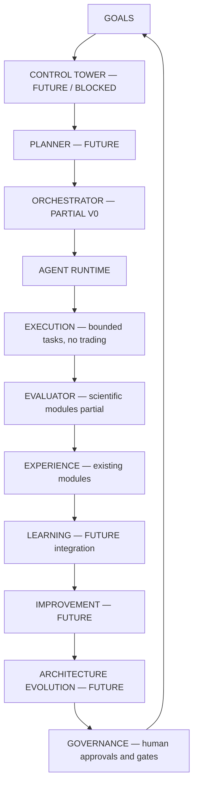

# Arquitectura

Fuente canónica: [master](../.axxel/master_architecture/README.md).
El siguiente flujo es la arquitectura objetivo; las flechas no acreditan despliegue.

| Componente | Implementación observada | Alcance |
|---|---|---|
| Data Engine | IMPLEMENTED, src/data/engine.py, scope.py, quality.py | Software probado; datos actuales no certificados |
| Track B V1/V2 | IMPLEMENTED, módulos versionados | V1 revocada; V2 sintético/inactivo |
| Research / ML / Skeptic | IMPLEMENTED como módulos | Consumo científico real bloqueado sin certificado |
| Orchestrator / memoria / value | PARTIAL, módulos V0 existentes | No Control Tower funcional ni autonomía promovida |
| Execution / MQL5 | PARTIAL, interfaces/stubs | No trading autorizado ni EA de producción |
| Control Tower / observabilidad general | PLANNED | Bloqueados por Foundation |
| Learning / Improvement / Architecture Evolution | PLANNED como capas integradas | Diseños, no sistemas operacionales |
| Governance | Reglas y aprobaciones documentadas | No promoción autónoma |

Shared Data Foundation pertenece al Data Engine; no es otro catálogo independiente.
El agente no es la arquitectura ni dueño exclusivo del estado. La matriz canónica
separa estado de implementación de autorización operacional.
